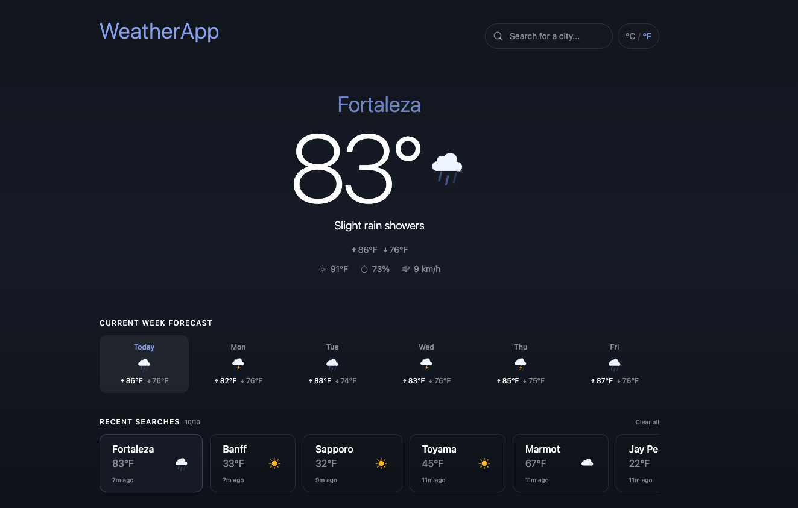
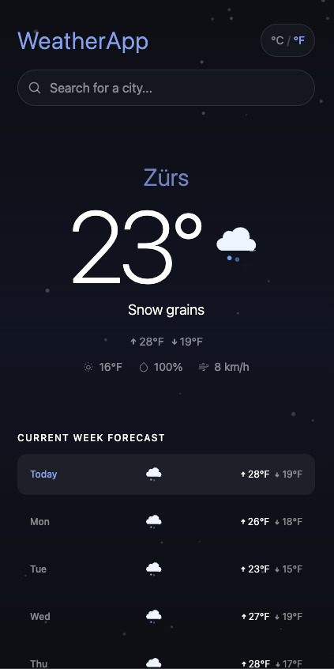
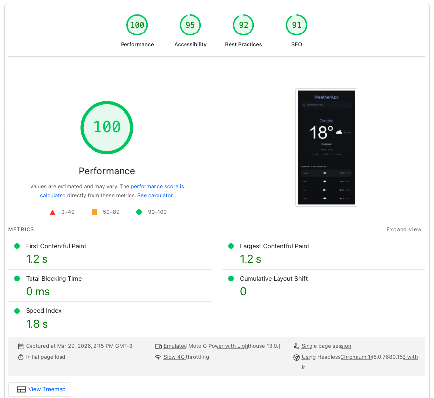

# WeatherApp

A personalized weather application with real-time city search, animated weather backgrounds, and cross-client sync — built on the edge with Cloudflare Workers and Durable Objects.

**[Live Demo →](https://weather-app-6v5.pages.dev)**

<p align="center">
  
</p>

<p align="center">
  
  &nbsp;&nbsp;&nbsp;
  
</p>

## What It Does

- **Search any city** with debounced autocomplete and keyboard navigation
- **See current weather** with temperature, feels like, humidity, wind, and hi/lo for the day
- **Browse the week forecast** with per-day conditions and temperature range
- **Track recent searches** — click to revisit, synced across all open clients in real time
- **Detect your location** automatically via browser geolocation, Cloudflare IP headers, or a sensible default
- **Share weather** by copying the URL — city, coordinates, and unit preference are encoded in query params
- **Toggle °C / °F** with one click, persisted to localStorage
- **Animated backgrounds** — rain drops, snow, twinkling stars, fog, and lightning flash based on live conditions
- **Works offline** — detects connectivity loss and shows cached data with an inline banner

---

## Tech Stack

| Layer | Technology |
|-------|-----------|
| Frontend | React 19, TypeScript, Vite 6, Tailwind CSS v4 |
| Backend | Hono on Cloudflare Workers |
| State | TanStack React Query v5, Durable Objects |
| Real-time | WebSocket via Durable Objects (hibernation-safe) |
| Testing | Vitest (61 tests), Playwright E2E |
| CI/CD | GitHub Actions → Cloudflare deploy |
| Tooling | Turborepo, pnpm workspaces, ESLint, Prettier, simple-git-hooks |

## Architecture

```
weather-app/
├── api/          Cloudflare Worker (Hono + single Durable Object)
├── web/          React SPA (Vite + Tailwind)
└── shared/       TypeScript types shared across packages
```

### Key Decisions

**Single Durable Object (`WeatherCache`)** handles weather caching, rate limiting, recent search history, and WebSocket broadcasting. Using `ctx.getWebSockets()` for hibernation-safe connections and `ctx.storage` for persistent state.

**Stale-while-revalidate caching** — the DO serves cached weather instantly (even if expired) and refreshes in the background via `waitUntil()`. Users never wait for a cold cache.

**React Query as the data layer** — `useQuery` for fetching, `useMutation` for writes, query key factory for cache management. No Redux, no Zustand — just hooks and React Query.

**Three-tier geolocation fallback** — Browser Geolocation API (5s timeout) → Cloudflare `cf` headers (IP-based) → default city. URL params override everything for shareable links.

**Custom SVG weather icons** — hand-drawn, animated, zero dependencies. Each icon is its own component, registered in an abstract `Icon` system with alias mapping.

**DO-backed rate limiting** — per-IP rate limiting using Durable Object storage (not in-memory Maps that reset per isolate). 60 requests/minute with proper `Retry-After` headers.

## Accessibility

- Skip-to-content link
- ARIA combobox pattern on search (keyboard navigation, `aria-activedescendant`)
- `aria-live="polite"` for weather updates
- Semantic HTML (`article`, `section`, `header`, `main`)
- `prefers-reduced-motion` support (disables all animations)
- Focus rings on all interactive elements
- Screen reader labels on icons and buttons

## Getting Started

### Prerequisites

- Node.js 22+
- pnpm 9+

### Install & Run

```bash
pnpm install
pnpm dev
```

Starts both the API (port 8787) and web (port 5173) via Turborepo. Vite proxies `/api` requests to the Worker.

### Testing

```bash
# Unit + component tests (61 tests)
pnpm test

# E2E tests
cd web && pnpm test:e2e
```

### Build

```bash
pnpm build
```

## Deployment

### API (Cloudflare Workers)

```bash
cd api
npx wrangler login
npx wrangler deploy
```

### Web (Cloudflare Pages)

Connect the repo to Cloudflare Pages:

- Build command: `cd web && pnpm install && pnpm build`
- Output directory: `web/dist`
- Environment variable: `VITE_API_URL` = your Worker URL
